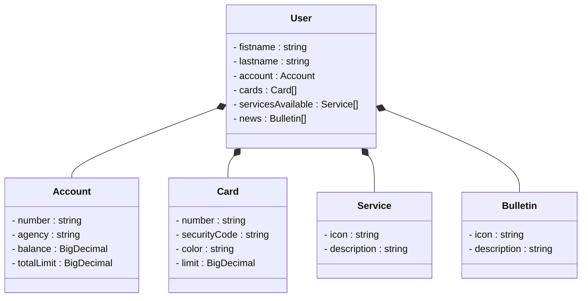

```mermaid
classDiagram
    class User {
        - fistname : string
        - lastname : string
        - account : Account
        - cards : Card[]
        - servicesAvailable : Service[]
        - news : Bulletin[]
    }

    class Account {
        - number : string
        - agency : string
        - balance : BigDecimal
        - totalLimit : BigDecimal
    }

    class Card {
        - number : string
        - securityCode : string
        - color : string
        - limit : BigDecimal
    }

    class Service {
        - icon : string
        - description : string
    }

    class Bulletin {
        - icon : string
        - description : string
    }

    User *-- Account
    User *-- Card
    User *-- Service
    User *-- Bulletin
```
